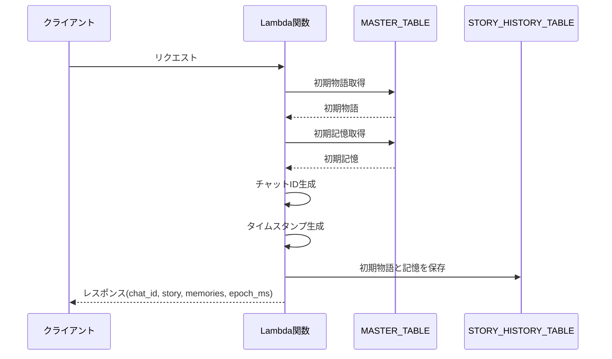
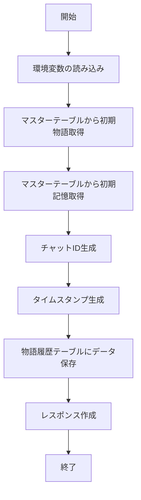

# init

## 処理概要

このLambda関数は, ゲーム最初の物語と初期記憶を生成し, DynamoDBに保存する.
ユーザーからのリクエストを受け取り, マスターテーブルから初期物語と初期記憶を取得し, 新しいチャットIDを生成して, 物語履歴テーブルに保存する.

## 用語と定義

| 日本語 | 英語 (変数名) | 定義 |
|--------|----------------|------|
| チャットID | chat_id | チャットを識別する一意の識別子 ${uuid4}-${epoch_ms} |
| 物語 | story | 本ゲームの物語 生成する文章 |
| 記憶 | memories | 物語に関連する重要な情報や出来事 |

## I/O

### DynamoDB書き込み内容 (STORY_HISTORY_TABLE)

| フィールド名 | 型 | 説明 |
|--------------|----|----|
| chat_id | String | チャットの識別子 |
| epoch_ms | Number | タイムスタンプ (ミリ秒) |
| story | String | 初期物語 |
| memories | Map | 初期記憶 (インデックスをキーとする辞書) |
| timestamp | String | ISO8601形式のタイムスタンプ |
| TTL | Number | レコードの有効期限 (秒) 1時間とする |

### レスポンス (body)

| フィールド名 | 型 | 説明 |
|--------------|----|----|
| chat_id | String | 生成されたチャットの識別子 |
| story | String | 初期物語テキスト |
| memories | Map | 初期記憶 (インデックスをキーとする辞書) |
| epoch_ms | Number | タイムスタンプ (ミリ秒) |

## シーケンス図

## フローチャート図

