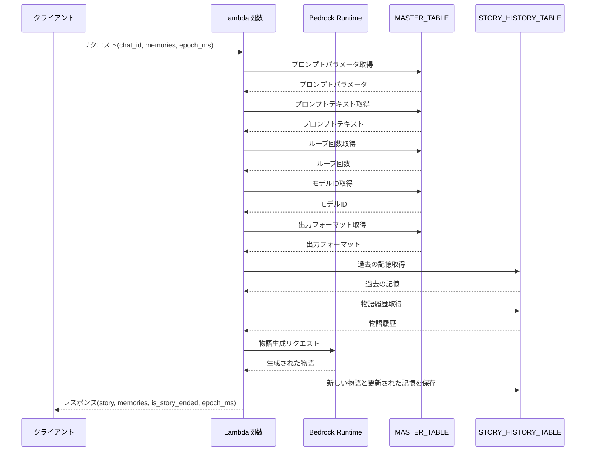
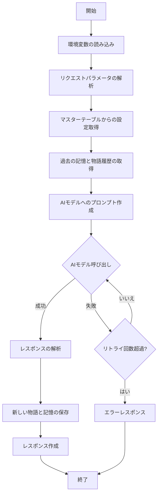

# story

## 処理概要

このLambda関数は, 生成AIを用いて物語と記憶を生成する.
ユーザーからのリクエストを受け取り, BedrockランタイムAPIを使用して新しい物語の続きを生成し, その結果をDynamoDBに保存する.
また, 過去の物語履歴や記憶を取得し, 新しい記憶を生成する.

## 用語と定義

| 日本語 | 英語 (変数名) | 定義 |
|--------|----------------|------|
| チャットID | chat_id | チャットを識別する一意の識別子 ${uuid4}-${epoch_ms} |
| 物語 | story | 本ゲームの物語 生成する文章 |
| 記憶 | memories | 物語に関連する重要な情報や出来事 |

## I/O

### 入力 (イベント)

| フィールド | 型 | 説明 |
|------------|-----|------|
| pathParameters.chat-id | string | URLエンコードされたチャットID |
| body.memories | list[int] | 使用する記憶のインデックスリスト   生成AIに任意の値を与えないため, 数字のみを受け付ける |
| body.epoch_ms | int | 前回の物語生成時のエポックミリ秒 |

### DynamoDB書き込み内容 (STORY_HISTORY_TABLE)

| フィールド名 | 型 | 説明 |
|--------------|----|----|
| chat_id | String | チャットの識別子 |
| epoch_ms | Number | タイムスタンプ (ミリ秒) |
| story | String | 生成された物語 |
| memories | Map | この時点の物語で使用する記憶 (インデックスをキーとする辞書) |
| timestamp | String | ISO8601形式のタイムスタンプ |
| TTL | Number | レコードの有効期限 (秒) 1時間とする |

### レスポンス (body)

| フィールド名 | 型 | 説明 |
|--------------|----|----|
| chat_id | String | チャットの識別子 |
| story | String | 生成された物語テキスト |
| memories | Map | 新しく生成された記憶 |
| is_story_ended | Boolean | 物語が終了したかどうか |
| epoch_ms | Number | タイムスタンプ (ミリ秒) |

## シーケンス図

## フローチャート図

